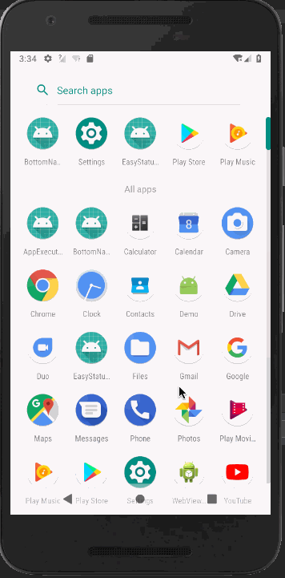

# EasyStatueView
一个用起来十分方便的StatueView，支持全局配置和局部修改，纯Kotlin编写。

## 集成方式

### gradle
Step 1. Add the JitPack repository to your build file
Add it in your root build.gradle at the end of repositories:
```
	allprojects {
		repositories {
			...
			maven { url 'https://jitpack.io' }
		}
	}
```
Step 2. Add the dependency
```
	dependencies {
	        implementation 'com.github.wintonBy:EasyZxing:1.0'
	}
```
## 使用方法

### 全局配置
这个库里默认就已经提供了效果图上的资源文件，如果不符合要求，可以在Application的onCreate()，方法中，根据需要进行配置。
#### Java 示例
```
StatusViewFactory.Companion.appConfig().errorTip(R.string.st1);
```
#### Kotlin 示例
```
StatusViewFactory.appConfig().errorTip(R.string.error_tip)
```
### 局部配置
#### Java 示例
```
statueView.setMErrorTextRes(R.string.st1);
#### Kotlin 示例
```
statueView.mNoNetworkTextRes = R.string.str2
```
### xml布局
```
 <com.winton.librarystatue.StatueView
    android:id="@+id/statue"
    android:layout_width="match_parent"
    android:layout_height="200dp">
    <TextView
        android:text="content"
        android:layout_width="match_parent"
        android:layout_height="match_parent" />
 </com.winton.librarystatue.StatueView>
```
### 显示状态
提供以下方法用于显示状态：
```
   /**
     * 显示加载中
     */
    fun showLoading()

    /**
     * 显示异常
     */
    fun showError()

    /**
     * 显示无数据
     */
    fun showEmpty()

    /**
     * 显示内容
     */
    fun showContent()

    /**
     * 显示无网络
     */
    fun showNoNetwork()
```
### 重试回调设置

接口：
```
interface IStatueListener {
    fun onRetry()
}
```
设置：
```
statueView.setMRetryListener(new IStatueListener() {
    @Override
    public void onRetry() {

    }
});
```
### 效果演示
<center>

</center>

## License
 Copyright 2018 Winton

Licensed under the Apache License, Version 2.0 (the "License");
you may not use this file except in compliance with the License.
You may obtain a copy of the License at

   http://www.apache.org/licenses/LICENSE-2.0

Unless required by applicable law or agreed to in writing, software
distributed under the License is distributed on an "AS IS" BASIS,
WITHOUT WARRANTIES OR CONDITIONS OF ANY KIND, either express or implied.
See the License for the specific language governing permissions and
limitations under the License.
